# Class Diagram - Tjap Satu (Laravel MVC)

Diagram ini menggambarkan struktur Model, View, dan Controller beserta relasinya.

## Class Diagram

```mermaid
classDiagram

    %% ==================== MODELS ====================
    class Customer {
        <<Model>>
        -id_cust : integer
        -nama_lengkap : string
        -alamat : string
        -email : string
        -no_telp : string
        -password : string
        -foto : string
        -is_admin : boolean
        ──────────────────
        +orders() : void
        +casts() : void
    }

    class Product {
        <<Model>>
        -id_product : integer
        -nama_produk : string
        -deskripsi : string
        -harga : decimal
        -stok : integer
        -gambar : string
        -jenis : string
        -proses : string
        ──────────────────
        +detailOrders() : void
    }

    class Order {
        <<Model>>
        -id_order : integer
        -tanggal_order : date
        -total_harga : decimal
        -tipe_pesanan : string
        -status_pesanan : string
        -id_cust : integer
        -id_kurir : integer
        ──────────────────
        +customer() : void
        +kurir() : void
        +detailOrders() : void
        +payment() : void
    }

    class DetailOrder {
        <<Model>>
        -id_detail : integer
        -jumlah : integer
        -subtotal : decimal
        -id_order : integer
        -id_product : integer
        ──────────────────
        +order() : void
        +product() : void
    }

    class Payment {
        <<Model>>
        -id_payment : integer
        -metode_bayar : string
        -tanggal_bayar : date
        -status_bayar : string
        -id_order : integer
        ──────────────────
        +order() : void
    }

    class Kurir {
        <<Model>>
        -id_kurir : integer
        -nama_kurir : string
        -plat_nomor : string
        -no_telp : string
        ──────────────────
        +orders() : void
    }

    class Cart {
        <<Model>>
        -id_cart : integer
        -id_cust : integer
        ──────────────────
        +customer() : void
        +items() : void
    }

    class CartItem {
        <<Model>>
        -id_item : integer
        -id_cart : integer
        -id_product : integer
        -jumlah : integer
        -catatan : string
        ──────────────────
        +cart() : void
        +product() : void
    }

    class Banner {
        <<Model>>
        -id : integer
        -title : string
        -image_path : string
        -link_url : string
    }

    class Promo {
        <<Model>>
        -id : integer
        -title : string
        -description : string
        -start_date : date
        -end_date : date
        -active : boolean
    }

    class Blog {
        <<Model>>
        -id : integer
        -title : string
        -excerpt : string
        -content : text
        -cover_path : string
        -published_at : date
    }

    %% ==================== VIEWS ====================
    class LandingPage {
        <<View>>
        +logo : file
        +banner_images : file
        +product_list : text
        +promo_section : text
        +email_login : text
        +password_login : text
        +form_register : text
    }

    class AboutPage {
        <<View>>
        +owner_name : text
        +owner_position : text
        +owner_image : file
        +owner_description : text
    }

    class MenuPage {
        <<View>>
        +product_list : text
        +product_image : file
        +product_name : text
        +product_price : number
    }

    class ProductDetailPage {
        <<View>>
        +product_name : text
        +product_image : file
        +product_price : number
        +product_description : text
        +product_jenis : text
        +product_proses : text
        +quantity : number
    }

    class CartPage {
        <<View>>
        +cart_items : text
        +item_name : text
        +item_price : number
        +item_quantity : number
        +total_price : number
    }

    class CheckoutPage {
        <<View>>
        +customer_name : text
        +customer_address : text
        +customer_phone : text
        +shipping_type : enum
        +payment_method : enum
        +subtotal : number
        +shipping_cost : number
        +total_payment : number
    }

    class CheckoutSuccessPage {
        <<View>>
        +order_id : number
        +success_message : text
        +order_summary : text
    }

    class ProfilePage {
        <<View>>
        +customer_name : text
        +customer_email : text
        +customer_phone : text
        +customer_address : text
        +customer_photo : file
        +current_password : text
        +new_password : text
        +order_history : text
    }

    class OrderDetailPage {
        <<View>>
        +order_id : number
        +order_date : date
        +order_status : enum
        +order_items : text
        +total_price : number
    }

    class AdminDashboardPage {
        <<View>>
        +total_orders : number
        +total_revenue : number
        +daily_revenue : number
        +top_products : text
        +order_summary : text
    }

    class AdminProductPage {
        <<View>>
        +product_list : text
        +nama_produk : text
        +harga : number
        +stok : number
        +deskripsi : text
        +gambar : file
        +jenis : text
        +proses : text
    }

    class AdminOrderPage {
        <<View>>
        +order_list : text
        +order_id : number
        +customer_name : text
        +order_date : date
        +order_status : enum
        +total_price : number
    }

    class AdminCustomerPage {
        <<View>>
        +customer_list : text
        +customer_name : text
        +customer_email : text
        +customer_phone : text
        +total_orders : number
        +total_spent : number
        +order_history : text
    }

    class AdminContentPage {
        <<View>>
        +banner_list : text
        +banner_title : text
        +banner_image : file
        +promo_list : text
        +promo_title : text
        +blog_list : text
        +blog_title : text
    }

    class AdminReportPage {
        <<View>>
        +total_revenue : number
        +total_orders : number
        +average_order : number
        +top_products : text
        +daily_sales_chart : text
    }

    %% ==================== MODEL RELATIONSHIPS ====================
    Customer "1" -- "0..n" Order : has
    Customer "1" -- "0..n" Cart : has
    
    Order "n" -- "1" Customer : belongs to
    Order "n" -- "0..1" Kurir : belongs to
    Order "1" -- "1..n" DetailOrder : has
    Order "1" -- "1" Payment : has
    
    DetailOrder "n" -- "1" Order : belongs to
    DetailOrder "n" -- "1" Product : belongs to
    
    Product "1" -- "0..n" DetailOrder : has
    
    Payment "1" -- "1" Order : belongs to
    
    Kurir "1" -- "0..n" Order : has
    
    Cart "n" -- "1" Customer : belongs to
    Cart "1" -- "0..n" CartItem : has
    
    CartItem "n" -- "1" Cart : belongs to
    CartItem "n" -- "1" Product : belongs to

    %% ==================== CONTROLLERS ====================
    class LandingController {
        <<Controller>>
        +index() : void
    }

    class AboutController {
        <<Controller>>
        +index() : void
    }

    class ProdukController {
        <<Controller>>
        +menu() : void
        +show(id: int) : void
    }

    class CartController {
        <<Controller>>
        +index() : void
        +addToCart(request: Request, id_product: int) : void
        +deleteItem(id_item: int) : void
        +updateQuantity(id_item: int, action: string) : void
    }

    class CheckoutController {
        <<Controller>>
        +index(request: Request) : void
        +process(request: Request) : void
        +success() : void
    }

    class ProfileController {
        <<Controller>>
        +index() : void
        +update(request: Request) : void
        +deletePhoto() : void
        +detailOrder(id: int) : void
        +updatePassword(request: Request) : void
        +logout(request: Request) : void
    }

    class AuthFlowController {
        <<Controller>>
        +showRegister() : void
        +submitLogin(request: Request) : void
        +submitRegister(request: Request) : void
    }

    class AdminAuthController {
        <<Controller>>
        +showLogin() : void
        +login(request: Request) : void
        +logout(request: Request) : void
    }

    class AdminDashboardController {
        <<Controller>>
        +index() : void
    }

    class AdminProdukController {
        <<Controller>>
        +index() : void
        +create() : void
        +store(request: Request) : void
        +edit(id: int) : void
        +update(request: Request, id: int) : void
        +destroy(id: int) : void
    }

    class AdminPesananController {
        <<Controller>>
        +index() : void
        +updateStatus(request: Request, id: int) : void
    }

    class AdminCustomerController {
        <<Controller>>
        +index(request: Request) : void
        +show(id: int) : void
        +destroy(id: int) : void
    }

    class AdminContentController {
        <<Controller>>
        +index(request: Request) : void
        +storeBanner(request: Request) : void
        +updateBanner(request: Request, banner: Banner) : void
        +deleteBanner(banner: Banner) : void
        +storePromo(request: Request) : void
        +updatePromo(request: Request, promo: Promo) : void
        +deletePromo(promo: Promo) : void
        +storeBlog(request: Request) : void
        +updateBlog(request: Request, blog: Blog) : void
        +deleteBlog(blog: Blog) : void
    }

    class AdminReportController {
        <<Controller>>
        +index() : void
    }

    %% ==================== CONTROLLER -> VIEW RELATIONSHIPS ====================
    LandingController "1" -- "1" LandingPage : renders
    AuthFlowController "1" -- "1" LandingPage : renders
    AboutController "1" -- "1" AboutPage : renders
    ProdukController "1" -- "1" MenuPage : renders
    ProdukController "1" -- "1" ProductDetailPage : renders
    CartController "1" -- "1" CartPage : renders
    CheckoutController "1" -- "1" CheckoutPage : renders
    CheckoutController "1" -- "1" CheckoutSuccessPage : renders
    ProfileController "1" -- "1" ProfilePage : renders
    ProfileController "1" -- "1" OrderDetailPage : renders
    AdminAuthController "1" -- "1" LandingPage : renders
    AdminDashboardController "1" -- "1" AdminDashboardPage : renders
    AdminProdukController "1" -- "1" AdminProductPage : renders
    AdminPesananController "1" -- "1" AdminOrderPage : renders
    AdminCustomerController "1" -- "1" AdminCustomerPage : renders
    AdminContentController "1" -- "1" AdminContentPage : renders
    AdminReportController "1" -- "1" AdminReportPage : renders

    %% ==================== CONTROLLER - MODEL DEPENDENCIES ====================
    LandingController "1" -- "n" Product : uses
    LandingController "1" -- "n" Banner : uses
    LandingController "1" -- "n" Promo : uses
    LandingController "1" -- "n" Blog : uses

    AboutController "1" -- "n" Blog : uses

    ProdukController "1" -- "n" Product : uses

    CartController "1" -- "n" Cart : uses
    CartController "1" -- "n" CartItem : uses
    CartController "1" -- "n" Product : uses

    CheckoutController "1" -- "n" Cart : uses
    CheckoutController "1" -- "n" CartItem : uses
    CheckoutController "1" -- "n" Order : uses
    CheckoutController "1" -- "n" DetailOrder : uses
    CheckoutController "1" -- "n" Payment : uses
    CheckoutController "1" -- "n" Kurir : uses

    ProfileController "1" -- "n" Customer : uses
    ProfileController "1" -- "n" Order : uses

    AuthFlowController "1" -- "n" Customer : uses

    AdminAuthController "1" -- "n" Customer : uses

    AdminDashboardController "1" -- "n" Order : uses
    AdminDashboardController "1" -- "n" Product : uses
    AdminDashboardController "1" -- "n" Customer : uses
    AdminDashboardController "1" -- "n" DetailOrder : uses

    AdminProdukController "1" -- "n" Product : uses

    AdminPesananController "1" -- "n" Order : uses
    AdminPesananController "1" -- "n" DetailOrder : uses
    AdminPesananController "1" -- "n" Kurir : uses

    AdminCustomerController "1" -- "n" Customer : uses
    AdminCustomerController "1" -- "n" Order : uses

    AdminContentController "1" -- "n" Banner : uses
    AdminContentController "1" -- "n" Promo : uses
    AdminContentController "1" -- "n" Blog : uses

    AdminReportController "1" -- "n" Order : uses
    AdminReportController "1" -- "n" DetailOrder : uses
```

## Legenda Simbol

| Simbol | Arti |
|--------|------|
| `-` | Private (atribut) |
| `+` | Public (method/atribut) |
| `nama : type` | Format atribut (nama diikuti tipe) |
| `nama(param: type) : void` | Format method dengan parameter |
| `──────` | Garis pemisah atribut dan method |
| `--` | Association/Relationship |

## Notasi Relasi

| Notasi | Arti |
|--------|------|
| `1` | Satu (one) |
| `0..1` | Nol atau satu (zero or one) |
| `0..n` | Nol atau banyak (zero or many) |
| `1..n` | Satu atau banyak (one or many) |
| `n` | Banyak (many) |

## Tipe Data

### Model (Database)
| Tipe | Keterangan |
|------|------------|
| `integer` | Bilangan bulat |
| `string` | Teks pendek (varchar) |
| `text` | Teks panjang |
| `decimal` | Angka desimal |
| `date` | Tanggal |
| `boolean` | True/False |

### View (UI)
| Tipe | Keterangan |
|------|------------|
| `number` | Input angka |
| `text` | Input/tampilan teks |
| `file` | Upload file (gambar) |
| `date` | Tampilan tanggal |
| `enum` | Pilihan dropdown |

## Ringkasan Class

### Models (11 class)
| Model | Deskripsi |
|-------|-----------|
| Customer | Data pelanggan dan admin |
| Product | Data produk kopi |
| Order | Data pesanan |
| DetailOrder | Detail item dalam pesanan |
| Payment | Data pembayaran |
| Kurir | Data kurir pengiriman |
| Cart | Keranjang belanja |
| CartItem | Item dalam keranjang |
| Banner | Banner promosi |
| Promo | Data promo |
| Blog | Artikel blog |

### Views (15 class)
| View | Deskripsi |
|------|-----------|
| LandingPage | Halaman utama + Login/Register |
| AboutPage | Halaman tentang kami |
| MenuPage | Daftar menu produk |
| ProductDetailPage | Detail produk |
| CartPage | Keranjang belanja |
| CheckoutPage | Proses checkout |
| CheckoutSuccessPage | Konfirmasi checkout berhasil |
| ProfilePage | Profil customer + keamanan akun |
| OrderDetailPage | Detail pesanan customer |
| AdminDashboardPage | Dashboard admin |
| AdminProductPage | CRUD produk admin |
| AdminOrderPage | Manajemen pesanan admin |
| AdminCustomerPage | Manajemen pelanggan admin |
| AdminContentPage | Manajemen konten (banner, promo, blog) |
| AdminReportPage | Laporan admin |

### Controllers (14 class)
| Controller | Deskripsi |
|------------|-----------|
| LandingController | Halaman utama |
| AboutController | Halaman tentang |
| ProdukController | Katalog produk |
| CartController | Keranjang belanja |
| CheckoutController | Proses checkout |
| ProfileController | Profil customer |
| AuthFlowController | Login/Register customer |
| AdminAuthController | Login/Logout admin |
| AdminDashboardController | Dashboard admin |
| AdminProdukController | CRUD produk |
| AdminPesananController | Manajemen pesanan |
| AdminCustomerController | Manajemen pelanggan |
| AdminContentController | Manajemen konten |
| AdminReportController | Laporan |

## Keterangan Relasi Model

| Model | Relasi | Target | Kardinalitas |
|-------|--------|--------|--------------|
| Customer | has | Order | 1 : 0..n |
| Customer | has | Cart | 1 : 0..n |
| Order | belongs to | Customer | n : 1 |
| Order | belongs to | Kurir | n : 0..1 |
| Order | has | DetailOrder | 1 : 1..n |
| Order | has | Payment | 1 : 1 |
| DetailOrder | belongs to | Order | n : 1 |
| DetailOrder | belongs to | Product | n : 1 |
| Product | has | DetailOrder | 1 : 0..n |
| Payment | belongs to | Order | 1 : 1 |
| Kurir | has | Order | 1 : 0..n |
| Cart | belongs to | Customer | n : 1 |
| Cart | has | CartItem | 1 : 0..n |
| CartItem | belongs to | Cart | n : 1 |
| CartItem | belongs to | Product | n : 1 |
